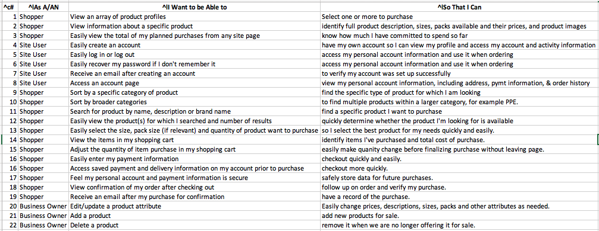

<h3 style="text-align: center">
    <a href="https://github.com/sherylg343/janeric">
        
    </a>
</h3>

<h1 style="text-align: center">
Janeric LLC Website
</h1>

<div style="text-align: center">

[View website deployed through Heroku](https://janeric.herokuapp.com/)
</div>

## Table of Contents <a name="table-of-contents"></a> 

1. [Project Purpose](#purpose)

2. [UX](#ux)

3. [Features](#features)

4. [Future_Goals](#future)

5. [Technology Used](#technology-used)

6. [Testing](#testing) - text in another document [TESTING](TESTING.md)

7. [Deployment](#deployment)

8. [Credits](#credits)

9. [Disclaimer](#disclaimer)

[Back to Top](#table-of-contents)


## Project Purpose <a name="purpose"></a> 
Janeric LLC was formed during the beginning of the coronavirus pandemic, with 
the goal of selling personal protective equipment in volume to organizations. 
As an established business owner, Eric Parsells approached is wife and children
about starting the business as a learning opportunity and a way to help 
frontline workers.

Management intended to develop a website using BigCommerce, but accepted the 
developer's offer to build the site for free as a final school project. The 
purpose of the website is provide a channel to sell products to all users of 
personal protective equipment within the United States.

### Project Goals
The primary goal of the website is to generate sales so the site needs to be 
user-friendly and enable both established account users and guest users to 
easily select and purchase products.

A secondary goal for the second phase of the project is to add information 
about the UV equipment that kills cornoviruses and other micro-organisms.  
Since this is a product that requires a more consultative sales approach,
the purpose of that product section on the site will be to educate and generate
sales leads.

### Target Audience
The client states that their target audience is not segmented, it is all users
and purchasers of personal protective equipment within the contiguous United
States.

<p>

[Back to Top](#Table-of-Contents)
</p>
---

## UX <a name="ux"></a>

### Targeted Visitors
The client's targeted visitors are users and purchasers of personal protective
equipment, with a focus on those buying for organizations. 

### User Stories
The following was based upon the user stories for the Boutique Ado project, but
revised to fit the needs of the Janeric website.

<h9 style="text-align: center">
        
</h9>

<p>

[Back to Top](#Table-of-Contents)
</p>
---


## Features <a name="features"></a>

### Use of Five Planes of UX in Project Design
#### Strategy Plane
The client's business is new and didn't have an established Unique Selling
Proposition initially. They developed the following phrase and specified
its use on the home page: "Clean and effective solutions to help keep
those you care about safe." 

An evaluation was conducted to determine which customer needs the website 
should address first. These customer needs are listed and reviewed in the 
[Strategy Trade-Off Analysis](README-ASSETS/janeric-strategy-tradeoff.pdf). 

The UV Lighting sales process and materials were not yet developed, so
they were rated lower in importance and will be added in the second phase.

Prior to developing this analysis, the following ecommerce websites were viewed and
evaluated based on client's preferences: Amazon, acacia.co for cart and checkout
system, aman, goop for functionality, jennikayne, ashleykane and singlethreadfarms.

#### Scope Plane
Below is a summary of the analysis done for this website during the Scope Plane.
1. Objective: The user wants a resource to quickly and easily purchase the
personal protective equipment, in the product and pack sizes needed, to operate 
their business, practice or other type of organization. The user is looking for
one vendor that can provide the equipment needed in a timely manner.
2. Functional: The users need to easily find the products of interest, as well
as checkout in an efficient, error-free manner.
3. Non-functional: The scientific research and educational material for 
UV Lighting will provide necessary content to support lead generation and
sales process, but those resources are not yet ready or available so will
be done in the second phase or sprint. Regarding security, allauth provides
verification for account creation and use, and additional packages need
to be obtained to help with shipping address verification. Given the limited
initial traffic anticipated, using a state select field and verifying format
of zip code will be adequate at this time, but full address verification
will be re-visited when traffic or shipping errors merit the effort to add it.
4. Business Rules: As this is a new business, sales materials and processes are
not fully established and human resources are a constraint, so not all product 
profiles are complete and UV Lighting is tabled for second phase.

#### Structure Plane
Below are the key considerations relative to the Structure Plane.
1. Consistency: 
* All links on the page are the same color of gray/blue and the hover/
active color is the bright blue that matches the logo color.
* All page headings use the same font as the logo (per client's request)
* search bar is at center and above page content for all pages and 
screen sizes
* Information is positioned to provide most important near the top of 
the page, particularly for mobile versions.
* The navigation is a side menu for all large and extra-large screens
as requested by client, set-off by the blush background. The only exception
is the home page so that menu doesn't interfere with hero image impact.
* Long pages all have "back to top" button in same color and position
2. Predictable: 
* placeholders for all input fields are same color and left-aligned.
* "Keep Shopping" link is in same location on all non-product pages and
appears in same color and typeface.
* Buttons are all same color and size, as well as clearly labeled
* Top nav bar is sticky so logo, account options and cart total appears
on each page wherever you are when scrolling.
3. Learnable:
* toast messages provide feedback to user about actions taken, color-coded
for type of message
* Nav dropdown menus are intuitive and easy to read
* Checkout page uses a stepper, collapsing each completed step to keep focus
on current step and minimizing clutter without changing pages
* Page headlines are in same location on each page, identifying page
user is visiting and its purpose
4. Visible
* Account menu items visible based upon whether user is signed in or not
* Product management pages and action buttons are only visible to store owner
signed in as superuser
* Product content is prioritized and stacked for mobile viewers
5. User Feedback:
* Spinner overlay is initiated when checkout button is clicked to let user
know order is being processed
* Error messages provide feedback regarding form submission problems
* Input field text color is different than placeholder text color providing
feedback that input is occurring.
* On checkout page, the icon for completed steps is gray and active step is
blue.

#### Skeleton Plane
Usability: the following design elements are designed the same to provide
consistency and improve usability throughout the site.
* quantity selector
* size and pack selector
* state input select widget - easier to use and improves accuracy
Also, on product profile page, the quantity and size/pack selector are placed
above the product description - ordering them in terms of importance.

Product cards used for search results, utlize the product family name and
minimize white space to keep the product information simple, uncluttered and
easy to view.

#### Wireframe Mock-Ups:
After reviewing the User Stories and evaluating the Features, the following
mockups were designed for the 3 primary screen sizes using 
[Balsamiq software](https://balsamiq.com/). 
The website was created using a mobile-first design philosophy.

<div style="text-align:center;">

[Mobile](README-ASSETS/janeric-mobile1b.pdf)
</div>

<div style="text-align:center;">

[Tablet](README-ASSETS/janeric-iPad1.pdf)
</div>

<div style="text-align:center;">

[Desktop](README-ASSETS/janeric-desktop1c.pdf)
</div>

#### SPECIAL NOTE regarding Wirefram Mock-Ups: 
The mock-ups were reviewed by the client and they made a number of
changes to the layout of the pages. Due to the project deadline and
the client's time constraints, a second round of mock-ups was not
done before work began on the website. Additionally, these changes
are not reflected in the mock-ups attached because the developer's
free Balsamiq trial expired prior to the end of the project.

#### Surface Plane
1. Background: 
* a hero image of personal protective equipment in use was selected to
create an impactful first impression in tandem with the company's USP and
a "Shop Now" button providing an immediate call-to-action.
* the color palette was based on the blue and white logo and then the 
client selected 
[Color Palette #4147](https://colorpalettes.net/color-palette-4147/) 
as accent colors.
2. Fonts:
* the client provided the Caslon 3 Roman font used in their logo, 
for page headlines. Barlow was used in cart and checkout for sub-headings
and Roboto is used for body text. Barlow and Roboto were selected for
being simple and clean.
* use of Barlow in subheads, all in caps and with increased letter spacing 
was modeled after Jenni Kayne website's shopping cart column headers.
3. Images/Icons:
* all product images supplied by client but used at significant size
as images are believed to be key element of product sales.
* client requested simple, clean look so icon use was minimal.
Controls:
* buttons and links are consistently colored and text chosen
to aptly describe actions to be taken.

### More on Features
Navigation: A sticky navigation bar with a dropdown menu for account links
provides easy access to all sections of the website wherever the user is.
A mobile version has a menu icon and side-slide navbar for ease of use.
The side-menu for larger screens in not as conventional, however, it was
specifically requested by the client.

Product Management: Because the product family name became a key
element of the website (the family name is used in most places rather
than the product name), the developer decided that the Product Management
section should include the ability to add and edit these names, and the
brand names which are part of the Product_Family model. Therefore, a
template was added listing the product family names, their brand names
and providing an edit button.  An "Add Product Family" button was also
included at the top and bottom of the list for ease of use. A delete
button was not included deliberately as that would delete necessary
history for products. The navigation options for Product Management
were changed to: Add a Product and Product Families. They were changed
in both the desktop and mobile navigation sections.

Defensive Design: as mentioned previously, this was a key concept considered
in designing the website and to provide security for both users and store
owners.
* Account menu options are limited based on whether a user is logged in
or not. Also, only a superuser has access to the Product Management page.
* A number of design factors were built in to protect the ordering and
payment process:
1. If the normal ordering process is interrupted, a back-up process is
provided using the webhook handlers. 
2. The back-up (webhook handler) process will try to place order 5 times 
with wait time intervals in between to allow plenty of time and attempts 
to complete order.
3. Error messages are set up to alert user if a problem occurs with the
order or payment process.
* Allauth package provides verification of users and protection of 
passwords
* Address verification was addressed - a software package was installed
to provide zip code verification and a state selector widget to improve 
accuracy of addresses.
* A checkbox provides the user with the option to use their shipping
address as their billing address, minimizing input and errors.
* A checkbox offers user option to save default shipping address,
another way to minimize input time and errors.
* Bootstrap toasts are used to provide user with immediate feedback
about the results of actions taken. Messages are color-coded to provide
additional feedback about the type of message, e.g. red headline for 
warning messages.
* Buttons clearly state the action the user will take, e.g. view and buy now.
* The search bar appears on all pages at the top of the page in the
same spot.
* The quantity button has limits put on it to avoid problems, it won't go
below 1 or above 99. Also, in the cart and "Update" link was added so that
a quantity is selected prior to adjusting value rather than it updating with
every click of the selector which could cause performance issues.

<p>

[Back to Top](#Table-of-Contents)
</p>
---


## Future Goals <a name="future-goals"></a>

### Complete Product Information
A number of product photos, 1 SKU and 1 price are still due from
the client. These need to be received and added to product model
ASAP.

### Improve website performance
Currently, the website pages scored between 8 and 63 on performance
in Lighthouse reports. Text compression appears to be the best
strategy for improving performance and that will be addressed
before the site goes into production.

### Direct the deployed site to purchased domain
Client has purchased domain name of www.janericllc.com and website
needs to be redirected to that domain prior to launching

### Select and implement a U.S. tax package
Given the complexity of US sales tax, a software package needs to be
selected and installed to calculate the correct sales tax. TaxJar
is currently being considered.

### Add a Buy Now button to the products on search results page
The client requested this feature and the products template
needs to be reconfigured to allow posting of the product data.

### Add checkbox to opt-in for marketing and promotions
This checkbox will be placed in the email section of checkout
page and saved in the UserProfile model.

### Automated testing for order and payment process added
The developer needs to spend more time learning about automated
testing for Django to implement it properly.

### Confirmation message and action before deleting product
Add a message and require a secondary action before deletion
is processed

### Add UV Lighting products, educational information and contact form
This sales process is not yet well-defined so once it is, additional
pages will be added to help educate user and gain qualified sales leads.

### Address verification
When traffic and sales increase, if there are issues with accuracy of
shipping addresses, django-address with Google API's could be added to
reduce shipping errors.

<p>

[Back to Top](#Table-of-Contents)
</p>
---


## Technology Used <a name="technology-used"></a>

## Languages, Frameworks, Editors & Version Control:
* HTML & CSS programming languages
* [MD Bootstrap](https://mdbootstrap.com/) - used to make the website
visually appealing with pre-made components
* [Python](https://www.python.org/) - used with Django to operate website
* [Django](https://www.djangoproject.com/) - framework used in 
conjunction with Python to create and operate the website
* [jQuery](https://ajax.googleapis.com/ajax/libs/jquery/3.4.1/jquery.min.js) 
* JavaScript - used with jQuery for functionality of website
* [GIT](https://git-scm.com/) - Version Control
* [GITHUB](https://github.com) - to host the repositories for this project and 
the live website preview

## Tools Used:
* [PostgreSQL](https://www.postgresql.org/) - used with Heroku to manage data for
the website
* [AWS-S3](https://s3.console.aws.amazon.com/s3/home?region=us-east-1#) - storage
for static and media files for the website
* [Heroku](https://www.heroku.com/home) - used to deploy nonproduction version of
website
* [Stripe](https://stripe.com/) - used to process payments on website
* [GoogleChromeDevTools](https://developers.google.com/web/tools/chrome-devtools) -
used to test and troubleshoot the functionality of the website and assist in
visual styling decisions, especially relative to screen sizes
* [GoogleFonts](https://fonts.google.com/) - Noto Sans JP and Hind Siliguri 
Font Styles
* [tinyjpg](https://tinyjpg.com/) - used to reduce image file sizes
* [NuHtmlChecker] (https://validator.w3.org/) - html validator
* [W3C_CSS_Validation](https://jigsaw.w3.org/css-validator/#validate_by_uri) - 
css code validator
* [JSHint](https://jshint.com/) - JavaScript validator that recognizes jQuery
* [JSDoc](https://jsdoc.app/) - for comments in JavaScript file
* [stackOverflow](https://stackoverflow.com/) - questions forum helped with
troubleshooting code
* [Lighthouse](https://chrome.google.com/webstore/detail/lighthouse/blipmdconlkpinefehnmjammfjpmpbjk?hl=en) - assess performance, accessibility
and best practices of web pages
* [Unicorn_Revealer](https://chrome.google.com/webstore/detail/unicorn-revealer/lmlkphhdlngaicolpmaakfmhplagoaln?hl=en-GB) - tool to assist in troubleshooting
issues in website

<p>

[Back to Top](#Table-of-Contents)
</p>
---


## Testing <a name="testing"></a>
Testing can be found in a separate file - [TESTING.md](TESTING.md)

<p>

[Back to Top](#Table-of-Contents)
</p>
---


## Deployment <a name="deployment"></a>
The following steps were taken to deploy my GitHub repository using Heroku.

### On Heroku website do the following:
1. Create an account or sign into an existing account
2. Click on "New" button and create a new app with a unique name
3. Click on Resources tab and then click on "Add-ons" and select
"Heroku Postgress" (free)

### In GitHub Repository do the following:
1. Install all required modules using "pip3" and additionally install the 
following modules for deployment: dj_dataabase_url, psycopg2-binary, gunicorn

4. Set up the postgress database in project level settings.py file:
* at top of file add "import dj_database_url"
* under "Database", comment out the existing Database settings
* add the following setting:
DATABASES = {
    'default': dj_database_url.parse('postgres://.....')
}
* save settings.py file with database changes
5. Connect to the new Heroku database by running migrations:
$python3 manage.py showmigrations
$python3 manage.py migrate
6. Import all product data into new database using fixtures files. For 
this website, three files were loaded:
$python3 manage.py loaddata categories
$python3 manage.py loaddata product-family
$python3 manage.py loaddata products
7. Create a superuser to log in to new database:
$python3 manage.py createsuperuser
and supply a username, email address and password
8. Before committing changes, change the database configuration so
database name is not in version control. Go to project level settings.py:
* add:
if 'DATABASE_URL' in os.env:
    DATABASES = {
        'default
: dj_database_url.parse(ps.environ.get('DATABASE_URL'))    
    }
else:
    DATABASES = {
        'default': {
            'ENGINE':  . . . .,
            'NAME':  . . . .
        }
    }
* add:
DEBUG = 'DEVELOPMENT' in os.environ
Development will be changed to False before moving site to production
9. Commit and push changes to repo
10. Review env.py file and make sure it is complete and listed in your 
.gitignore file:
* Format of entries should follow this example:
after listing "import os" at the top of the file:
os.environ.setdefault("DATABASE_URL_JANERIC", "postgres://mugoqqsebccccc:xxxxxxx")
* Ensure all important project variables are included, such as Secret Key, 
Stripe keys, and database url
* For each environmental variable, check to make sure the variable 
(such as API_KEY) is defined as follows in the project level settings.py 
file: API_KEY = os.environ.get('API_KEY').
11. Once all necessary modules are installed in repository and env.py file is
complete, create a Requirements.txt file listing all installed modules by 
typing the following into the terminal after the $ prompt: 
pip3 freeze --local > requirements.txt
12. Create Procfile at top level of repo and add the following text
at top of file: 
web: gunicorn {app name}.wsgi:application
13. Confirm both files have been added to the directory of the repository.
14. Temporarily disable collectstatic
$heroku login -i
provide heroku login email and password
$heroku config:set DISABLE_COLLECTSTATIC=1 --app {heroku app name}
15. Go to project level settings.py file and add host name of Heroku
app
ALLOWED_HOSTS = ['janeric.herokuapp.com', 'localhost']
16. Commit and push changes

### On Heroku website do the following:
1. Click on app name and then click on Settings in menu bar at top
of page
2. In middle of page, in "Config Vars" section, click on box that reads, 
"Reveal Config Vars"
3. Go to a django key generator website and obtain a django secret key
4. Go back to the Config Vars section with be "key" and "value" input boxes. 
For all applicable variables, such as Secret Key, database url, and Stripe 
secret keys, and Development(True): input key and value and click "add".
5. Once all variables have been input, click on "Deploy" in menu bar.
6. In "Deployment Method" section, click on "GitHub"
7. Under section heading "Search for a repository to connect to,"
type in repository name following GitHub display name and hit return
or the "Search" button.
8. The name of the repo found in GitHub will be printed below,
click on the "Connect" button across from it, if it is correct.
9. The app is now connected to the specified GitHub repository.
10. To enable automatic deployment, scroll down to "Automatic Deploys"
section and click on button "Enable Automatic Deploys."
11. In menu button, click on "Settings" and scroll down to section
titled "Domains" and you will find your domain address:
Your app can be found at 
[https://janeric.herokuapp.com/](https://janeric.herokuapp.com/)
12. After instigating automatic deployment, all changes committed
to the GitHub repository will be reflected in the deployed site on
Heroku.

### On Amazon AWS website do the following:
1. Create an account or sign into an existing account
2. In the Search bar next to services, search for S3 and then click on it
3. Under "Buckets" header, click the orange button titled "Create Bucket."
This bucket is a container to store data in S3.
4. Under "Create Bucket" in the "General Configuration" box, type in 
Bucket Name, suggest using same name as used for Heroku app for ease.
5. In "Region" select input, select the region closest to your location.
6. In the "Bucket settings for Block Public Access" box, UNCHECK the box 
next to "Block all public access."
7. Scroll down and check the box next to the statement "I acknowledge that 
the current settings might result in this bucket and the objects within
becoming public."
8. Scroll down and click the orange "Create Bucket" button.
9. Back on the "Buckets" page, click on the bucket name link that you just
created.
10. Click on the "Properties" tab across the top.
11. Scroll down to section titled "Static website hosting" and click "Edit"
button.
12. Click the "Enable" button under the subtitle "Static website hosting"
and under subtitle "Hosting type," click button next to "Host a static
website."
13. Scroll down to subtitle "Index document" and type in "index.html" and
beneath subtitle "Error document" type in "error.html."
14. Scroll down and click orange button titled "Save changes."
15. Click on the Permissions tab to make 3 changes.
16. Scrolling down to the "Cross-origin resource sharing (CORS)" section, click
on "Edit" button and then type or paste in the following to provide the 
required access between the Heroku app and the S3 bucket, then click to "Save changes":
[
    {
        "AllowedHeaders": [
            "Authorization"
        ],
        "AllowedMethods": [
            "GET"
        ],
        "AllowedOrigins": [
            "*"
        ],
        "ExposeHeaders": []
    }
]
17. Before making the additional changes in Permissions tab, we need to create
a user to access the S3 bucket. To do this we will use AWS' IAM (Identity &
Access Management). Since we will be shifting between S3 and IAM, open AWS in 
a new browser tab. On AWS go to Management Console and use the Search bar
at the top and type in "IAM".  Click on "IAM" under the "Services" category.
18. Once in the IAM section, click on "Groups" in the left menu. Once that
screen appears, click on the blue button titled "Create New Group."
19. On the next screen, type in a name in the input box next to "Group
Name." For a group name, suggest using "manage-" as prefix to bucket name as
a group name. Then click the blue button titled "Next Step."
20. Click the "Next Step" button again as we don't have a policy to attach
to it yet. Then click on the "Create Group" button.
21. Back on the IAM dashboard page, click on "Policies" in left menu, under
"Access management." Then click the "Create policy" blue button and on the
next screen click on the "JSON" tab.
22. Click on the "Import managed policy" link in top right.
23. In the next screen, type in S3 in the search bar and then select the
option "AmazonS3FullAccess." Click the blue "Import" button.
24. Since we don't want to actually allow full access to our whole account, 
only the new bucket and everything in it, go back to S3 Buckets page browser 
tab, click on the bucket using and then click on the Permissions tab.
25. Scroll down to the "Bucket policy" section and click the "Edit" button.
26. Copy the text below the sub-heading "Bucket ARN."
27. Go back to the IAM browser tab where you left off in the "JSON" tab.
Within the JSON code, delete the "*" next to the key "Resource" and replace
with the aarn code just copied so it looks like the following:
        "Resource": [
            "arn: . . .",
            "arn: . . . /*"
        ]
This will include the bucket and also all files and folders in the bucket.
28. Click the "Review Policy" button and add the following:
* Name: suggest using the bucket name with "-policy" as a suffix to it.
* Description: suggest "Access to S3 bucket for {app-name} static files.
* Click "Create Policy" button.
29. You will be back to the policy page where there is message that the
policy has been created and listing its name. Now you want to attach the
policy to the group created in IAM.
* Click on "Groups" in left menu.
* Click on the link for the group name just created.
* Click the "Permissions" tab.
* Click "Attach Policy" button.
* Use search bar to search for the policy name created in #28 and select it.
* Click "Attach Policy" button.
30. Create a user in IAM by clicking "Users" in the left menu.
31. Click the blue "Add User" button in top left.
32. Type in a "User name," suggest using the bucket name with "-staticfiles-
user" as suffix.
33. In the "Select AWS access type" section, under "Access type" click the 
box next to "Programmatic access" and then click the "Next: Permissions" button.
33. Make sure you are in teh "Add user to group" section and then click on
the name link for the group name recently created. Then click the "Next" buttons
until reach screen with "Create user" button and click it.
34. Click on the "Download .csv" button downloads a file that contains this
user's access key and secret access key which will be used to authenticate
the user in our Django app. IMPORTANT: be sure to download and SAVE this file
as you will not be able to download and access it again.

### In GitHub Repository do the following to connect Django to S3 bucket:
1. Install 2 new packages and create new requirements file:
* $pip3 install boto3
* $pip3 install django-storages
* $pip3 freeze > requirements.txt
2. Go to the projects level settings.py file and do the following:
* under INSTALLED_APPS add 'storages',
* below MEDIA_ROOT, add the following:
if 'USE_AWS" IN os.environ:
     AWS_STORAGE_BUCKET_NAME = '{bucket name}' 
     AWS_S3_REGION_NAME = 'us-east-2' or your applicable region
     AWS_ACCESS_KEY_ID = os.environ.get('AWS_ACCESS_KEY_ID')
     AWS_SECRET_ACCESS_KEY_ID = os.environ.get('AWS_SECRET_ACCESS_KEY_ID')

### On Heroku website do the following:
1. Go to your app, click on 'Settings" and then click to reveal "Config Var"
2. Add the following as new config variable key and value pairs:
* AWS_ACCESS_KEY_ID, {paste in value from .csv file downloaded}
* AWS_SECRET_ACCESS_KEY_ID, {paste in value from .csv file downloaded}
* USE_AWS, True
3. Scroll up the Config Var and remove the DISABLE_COLLECTSTATIC variable

### In GitHub Repository do the following:
1. Go back to project level settings.py file and continue connecting Django
to our S3 bucket by adding:
AWS_CUSTOM_DOMAIN = f'{AWS_STORAGE_BUCKET_NAME}.S3.amazonaws.com'
2. Tell Django that in production we want to use S3 to store static files:
* At root level, create file called custom_storages.py
* Inside this file add:
from django.conf import settings
from storages.backends.s3boto3 import S3Boto3Storage


class StaticStorage(S3Boto3Storage):
    location = settings.STATICFILES_LOCATION


class MediaStorage(S3Boto3Storage):
    location = settings.MEDIAFILES_LOCATION
3. Go back to project level settings.py file and add the following:
* #Static and Media files
STATICFILES_STORAGE = 'custom_storages.StaticStorage'
STATICFILES_LOCATION = 'static'
DEFAULT_FILE_STORAGE = 'custom_storages.MediaStorage'
MEDIAFILES_LOCATION = 'media'
* Also add the following to override and explicity set the URL's for 
static and media files using our custom domain and the new locations
#Override static and media URLs in production
STATIC_URL = f'https://{AWS_S3_CUSTOM_DOMAIN}/{STATICFILES_LOCATION}/'
MEDIA_URL = f'https://{AWS_S3_CUSTOM_DOMAIN}/{MEDIAFILES_LOCATION}/'
4. Add additional setting that tells browser it's ok to cache static
files for a long time since they don't change very often and this
improves performance of site for users. Place this below MEDIA_ROOT 
variable:
if 'USE_AWS' in os.environ:
    # Cache control
    AWS_S3_OBJECT_PARAMETERS = {
        'Expires': 'Thu, 31 Dec 2099 20:00:00 GMT',
        'CacheControl': 'max-age=94608000',
    }
5. Save file and commit and push to GitHub. This will trigger an 
automatic deployment to Heroku and the collectstatic action.

### On AWS site, visit S3 dashboard:
1. Confirm that all static files were added to the bucket in 
static labelled folders.
2. To add media files to S3 do the following:
* Click on bucket name link in dashboard
* Click on "Objects" tab in bucket overview
* Click "Create folder" button
* Enter folder name: media and click "Create folder" button
* Click on the media folder name link
* Click on "Upload" button
* Click on "Add files" button
* In computer finder/directory window, select files to be added and drag and drop
files to media folder
* Scroll down and click on "Add/Upload Options" link
* Go to "Access Control List (ACL)" and click to give "Everyone" public access
to "Read" these files
* Scroll down and click box to acknowledge the effects of this change
* Click "Upload" button

### Go to {heroku app name}.herokuapp.com/admin/:
1. Log in as superuser
2. Go to email address table and find superuser email address and click
on boxes next to "Verified" and "Primary"
3. If the email address does not exist, go to deployed site and log in,
forcing the creating of the email address, then back to admin page to
complete action #2.

### On Stripe.com website dashboard do the following:
1. Click on Webhooks
2. Click "Add endpoint"
3. New endpoint should be url for Heroku app, formatted as follows:
[https://janeric.com/checkout/wh](https://janeric.com/checkout/wh)
3. Scroll down and click on link stating "receive all events"
4. Click "Add endpoint"
5. Click "reveal secret" and copy secret for this endpoint

### On Heroku website do the following:
1. Go to your app, click on 'Settings" and then click to "reveal config var"
2. Add the following as new config variable key and value pairs:
* STRIPE_WH_SECRET, secret copied from stripe for new endpoint
* reference project env.py file for next two variable values:
STRIPE_SECRET_KEY
STRIPE_PUBLIC_KEY
and add to variable listed

DEPLOYMENT IS COMPLETE!!

### How to Run this Project Locally
To run the project locally, make a clone of it from GitHub:

1. Working from the GitHub repository page, find the green button on right 
labeled **Clone or download** and click it to open a dropdown menu.
2. Below the headline **Clone with HTTPS** is a web address, click on the 
button to the right of it to copy the link.
3. In your local IDE open Git Bash.
4. Change the current working directory to the location where you want to 
place the cloned directory.
5. Type ```git clone```, then paste the clone URL address copied in step 2 
as follows:
```console git clone https://sherylg343.github.io/thriller-books2/```
6. Press enter to finish creating the local clone.

<p>

[Back to Top](#Table-of-Contents)
</p>
---

## Credits <a name="credits"></a>

### Images
All images were supplied by the client, Janeric LLC

### Contents
All content was provided by the client, Janeric LLC

### Code
1. Code to display user's local time came from "Auto time zone in Django," 
August 30, 2019, [JackJackAttack!](https://xjlin0.github.io/tech/2019/08/30/auto-time-zone-in-django/)
2. Code for Favicon came from blog article "Add a Custom Favicon to your
Django Web App," April 17, 2020 by [<ordinary>coders](https://www.ordinarycoders.com/blog/article/add-a-custom-favicon-to-your-django-web-app#:~:text=If%20you%20are%20still%20getting,folder%20%3E%20static%20%3E%20img%20folder.)
3. Component code from [MDBootstrap](https://mdbootstrap.com/) - great components and
great supporting code on site and forum.

### Acknowledgements
Many thanks to Code Institute tutors and alumni who provided assistance
throughout the development phase, with special appreciation extended towards:

* Brian Macharia - mentor; Brian provided extraordinary guidance and 
insight that enabled me to tackle this project.
* Code Institute Tutors: Cormac, Samantha, Igor, Scott, Kevin, Haley, Miklos
and Johann.

<p>

[Back to Top](#Table-of-Contents)
</p>
---


## Disclaimer <a name="disclaimer"></a>
Please note the content and images on this website are for educational purposes only.

<p>

[Back to Top](#Table-of-Contents)
</p>